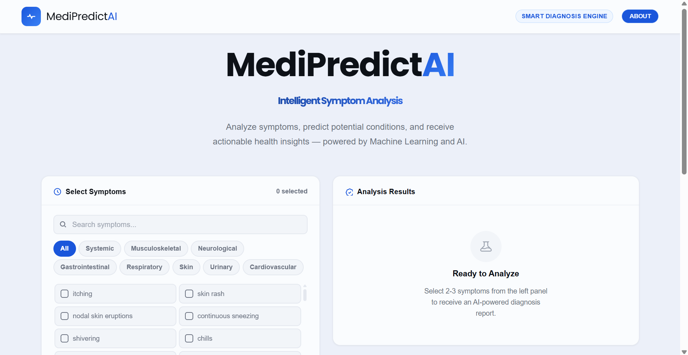
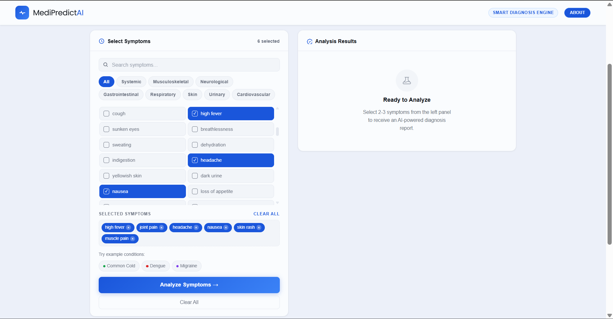
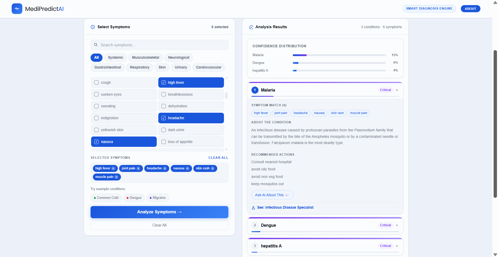
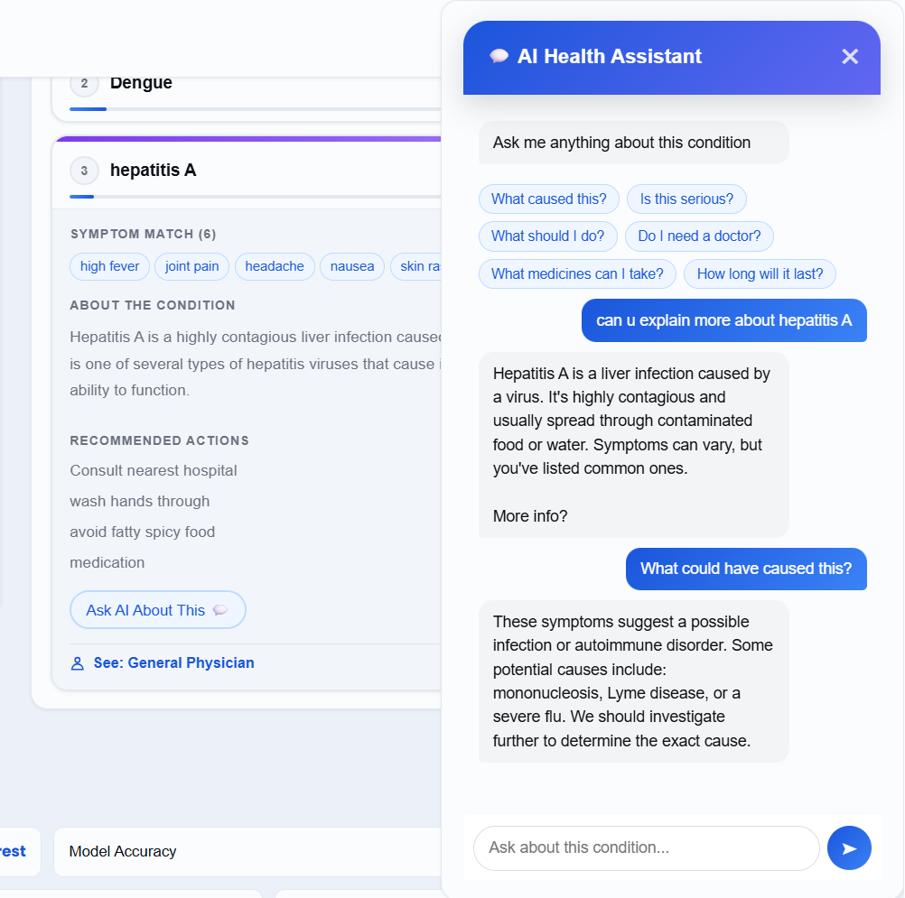

# MediPredict AI 

MediPredict AI is an AI-powered and medical assistance platform that analyzes symptoms and provides possible conditions along with severity levels and medical suggestions.

---

##  Preview









---

## Features

* Symptom-based multi-disease prediction using Machine Learning.
* Probability-based ranking of conditions.
* Severity analysis (Low → Critical).
* Precautions and disease descriptions.
* AI-powered assistant for real-time health queries.
* Clean and interactive UI.

---

## Tech Stack

* Backend: Python, FastAPI
* Machine Learning: Random Forest (Tuned with GridSearchCV)
* Frontend: HTML, CSS, JavaScript
* AI Integration: Groq API

---

##  How It Works

1. User selects symptoms
2. Symptoms are converted into a feature vector
3. ML model predicts possible diseases
4. Returns results with probabilities, severity, and precautions

---

##  Model Details

* Algorithm: Random Forest
* Accuracy: ~99%
* Dataset: Kaggle Medical Dataset
* Symptoms: 132
* Diseases: 41

---

##  Setup Instructions

### Backend

```bash
cd backend
pip install -r requirements.txt
python -m uvicorn main:app --reload
```

### Frontend

Open:

```bash
frontend/index.html
```

---

## Disclaimer

This project is for educational purposes only and does not replace professional medical advice.  Always consult a healthcare provider for medical concerns.

---

##  Author

Built & Designed by **Nihira Hassan**
